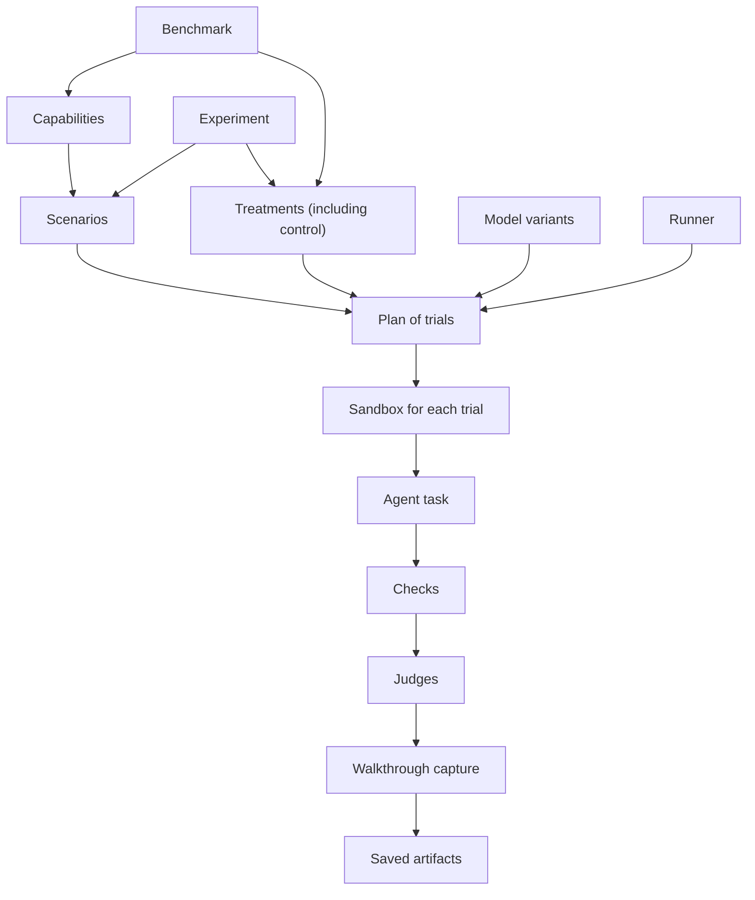

# Overview

agent-eval is a TypeScript library and CLI for evaluating **agents doing work**,
not just model responses to isolated prompts. Each trial gives an agent a
starting project inside a Docker container, asks it to complete a task, and
evaluates the resulting workspace.

The project supports two related questions:

- **Benchmark:** How well does our current agent setup support the capabilities
  we care about, relative to control?
- **Experiment:** Which intervention helps agents perform better on the same
  tasks, and why?

Use a benchmark for a reusable baseline across models or over time. Use an
experiment to compare instructions, skills, custom agents, MCP servers, plugins,
or other environment changes before adopting them.

## How the models fit together



A scenario owns the task and evaluation. A treatment changes the environment.
A model variant selects the model and reasoning effort; a runner selects the
implementation backend. A trial is one combination of those dimensions. A plan
is the list of trials to execute. Results contain evidence, not just a score.

## Methodology

Write a hypothesis before creating an evaluation:

> With [treatment], an agent is more likely to [observable behavior] while
> completing [representative task].

Keep four surfaces separate:

| Surface   | Responsibility                                  |
| :-------- | :---------------------------------------------- |
| Prompt    | The user's task and genuine product constraints |
| Fixture   | The smallest realistic starting workspace       |
| Treatment | The knowledge or capability being compared      |
| Grader    | Private checks and rubrics measuring the result |

Do not teach the treatment's requirements in the prompt. If the hypothesis is
that a skill teaches accessible interaction design, the task might be "Add a
navigation menu", not a checklist copied from the skill. Genuine user
requirements still belong in the prompt.

Keep the prompt, fixture, dependencies, model, effort, runner, and grader fixed
when comparing resource treatments. Shared prerequisites belong in shared setup;
the intervention belongs in treatment setup. Pin or vendor external resources.

Grade observable behavior rather than one preferred implementation. Use tests
for deterministic behavior and judges for criteria that need judgment. Check
that an untouched fixture fails for the intended reasons, a correct solution
passes, and plausible alternative solutions are accepted.

Begin with one representative task and a small comparison. Inspect individual
failures before expanding. Repeat close comparisons and use held-out tasks
before claiming generalization. A single successful run proves the wiring works,
not that the treatment is reliably better.

Prefer the smallest resource that meets the behavioral goal without important
regressions. Consider runtime, resource footprint, and usage as well as quality.
Keep infrastructure errors separate from agent task failures.

## Your evaluation project

```text
package.json
benchmarks/
  baseline.ts
experiments/
  instructions.ts
scenarios/
  001-task/
    package.json
    scenario.config.ts
    scenario.test.ts
    vitest.config.scenario.ts
    ...starting project files
results/
  ...one directory per run
```

The CLI defaults to these configuration directories, but accepts directory
overrides. Configuration filenames identify benchmarks and experiments;
scenario directory names identify scenarios. Display names describe them.

Use `@primer/agent-eval/benchmark`, `/experiment`, and `/scenario` for their
respective `defineConfig` helpers. Use `/sandbox` for public sandbox runtime and
types. The package root exports discovery and result-reading/report helpers.
Do not import unpublished `src/` internals.

## The upstream repository

In [primer/agent-eval](https://github.com/primer/agent-eval), `packages/agent-eval`
contains the published library and CLI. `docs` contains usage documentation,
`benchmarks`, `experiments`, and `scenarios` contain evaluations, `skills`
contains installable agent guidance, and `website` presents results.

Those are upstream development conventions, not directories an installed skill
can assume exist in a consumer project. The references bundled with this skill
are sufficient for the introductory workflow.
